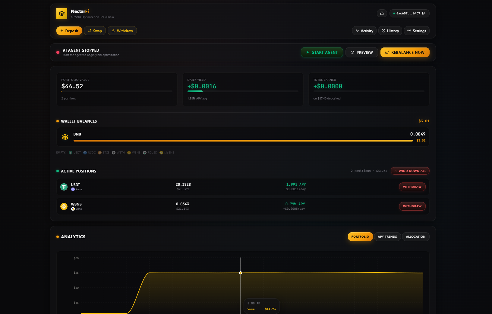
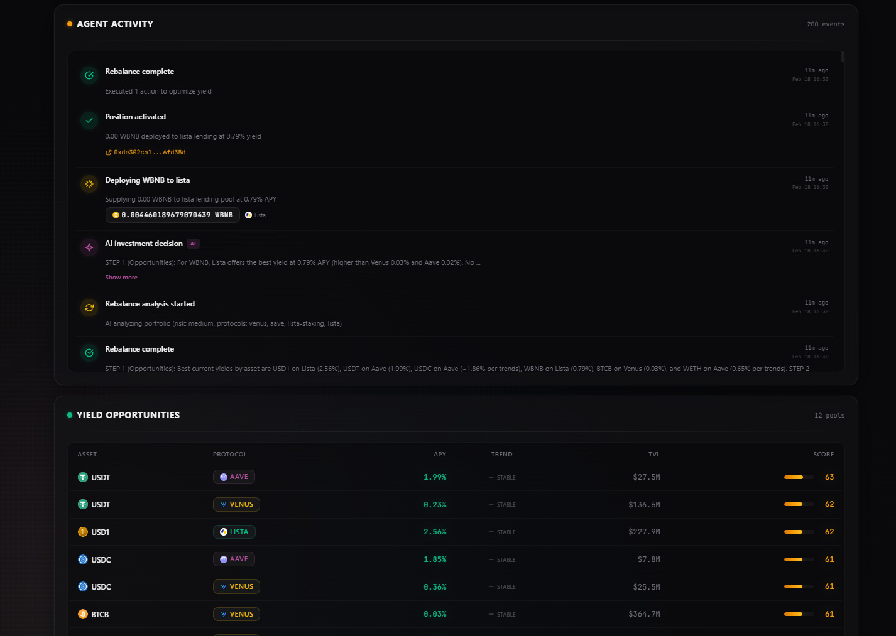

# NectarFi — AI-Powered DeFi Yield Optimizer on BNB Chain

> Autonomous AI agent that manages your DeFi portfolio across Venus, Aave V3, and Lista (Moolah) on BSC. Deposit once, earn optimized yield — the agent handles the rest.

**Hackathon:** [Good Vibes Only: OpenClaw Edition](https://dorahacks.io/hackathon/goodvibes/detail) | **Track:** DeFi + Agent | **Built by:** [@Magicianafk](https://x.com/Magicianafk)

**Live Demo:** [nectarfi.vercel.app](https://nectarfi.vercel.app) | **Backend API:** [nectarfi.onrender.com](https://nectarfi.onrender.com)

---

## What is NectarFi?

NectarFi is an AI DeFi yield optimization agent that autonomously manages user funds across the top lending protocols on BNB Chain. Users deposit tokens into their personal agent wallet, configure risk preferences, and the AI continuously monitors yields, executes rebalances, and swaps between assets to maximize returns — all verified on-chain.

### The Problem

DeFi users leave yield on the table because:
- Monitoring APY rates across protocols is tedious
- Rebalancing requires manual transactions and gas
- Swapping between assets to chase better yields requires constant attention
- Risk management across multiple protocols is complex

### The Solution

NectarFi automates the entire yield optimization workflow:
1. **Deposit** tokens to your personal agent wallet (Privy embedded wallet)
2. **Configure** risk level, whitelisted protocols/assets, APY thresholds
3. **AI analyzes** yields every 30 minutes using GPT-5.2
4. **Agent executes** supply, withdraw, rebalance, and swap operations autonomously
5. **Track everything** via real-time dashboard with live activity feed

---

## On-Chain Proof

**Agent Wallet:** [`0x380742dC8c1572406be32CD4F4b3CfaDF22293f6`](https://bscscan.com/address/0x380742dC8c1572406be32CD4F4b3CfaDF22293f6)

Verified transactions executed autonomously by the AI agent on BSC mainnet:

| Action | Protocol | Asset | Amount | TX Hash |
|--------|----------|-------|--------|---------|
| Deposit | Lista Moolah | WBNB | ~0.036 WBNB | [`0x928e0c...`](https://bscscan.com/tx/0x928e0c52f7424c4294794c6c59cab5aa0cd8ee0518b46ded66bed098792f8bbc) |
| Deposit | Lista Moolah | USD1 | ~67.05 USD1 | [`0xf255bd...`](https://bscscan.com/tx/0xf255bd9475684bfbba625179623b875b9fca472e9a9106ce77bc9ee1935e1514) |
| Swap | PancakeSwap V3 | USD1 → USDC | ~67.06 USDC | [`0x27a229...`](https://bscscan.com/tx/0x27a229617d0ba7795e1b27e995240b975cf7082df289487c3d9e28d546098eb2) |

### How It Works End-to-End

1. The AI agent fetches live APY rates from Venus, Aave V3, and Lista via on-chain reads + DeFiLlama enrichment
2. GPT-5.2 analyzes the user's idle wallet balances, current positions, and all yield opportunities
3. It returns structured JSON actions (e.g. "supply 40.49 USDC to Aave at 1.82% APY")
4. The backend executor approves tokens and executes the supply/deposit transactions via Privy server wallet
5. All decisions and transactions are logged to the activity feed in real-time

**Example AI reasoning (from real rebalance):**
> "USDT earns the most on Aave at 1.97% (higher than Venus 0.23%). For BNB, Lista offers the best WBNB yield at 0.81%. Supply 100% of idle USDT to Aave. Supply idle BNB as WBNB to Lista, leaving 0.005 BNB for gas."

---

## Architecture

```
┌──────────────────────────────────────────────────────┐
│                    Frontend (Next.js 16)              │
│  Dashboard · Settings · Activity · History · Charts  │
│  Privy Auth · Deposit/Withdraw/Swap UI               │
└─────────────────────────┬────────────────────────────┘
                          │ REST API + WebSocket
┌─────────────────────────▼────────────────────────────┐
│                 Backend (Express + TypeScript)        │
│                                                      │
│  ┌─────────────┐  ┌──────────────┐  ┌────────────┐  │
│  │  AI Engine   │  │  Scheduler   │  │  Executor  │  │
│  │  (GPT-5.2)   │  │  (Cron Jobs) │  │  (On-chain)│  │
│  └──────┬──────┘  └──────┬───────┘  └─────┬──────┘  │
│         │                │                 │         │
│  ┌──────▼────────────────▼─────────────────▼──────┐  │
│  │           Protocol Adapters                     │  │
│  │   Venus · Aave V3 · Lista · PancakeSwap V3    │  │
│  └────────────────────┬───────────────────────────┘  │
│                       │                              │
│  ┌────────────────────▼───────────────────────────┐  │
│  │  Privy Server Wallet · Supabase DB · DeFiLlama │  │
│  └────────────────────────────────────────────────┘  │
└──────────────────────────────────────────────────────┘
                          │
                    BNB Chain (BSC)
```

### Tech Stack

| Layer | Technology |
|-------|-----------|
| **Frontend** | Next.js 16, React 19, TypeScript, Tailwind CSS v4, shadcn/ui, Recharts |
| **Backend** | Node.js, Express, TypeScript, node-cron |
| **AI** | OpenAI GPT-5.2 (structured output for investment decisions) |
| **Wallet** | Privy server-side embedded wallets (per-user, non-custodial) |
| **Auth** | Privy (wallet connect) |
| **Database** | Supabase (PostgreSQL) |
| **On-Chain** | viem, BNB Chain (BSC mainnet) |
| **Protocols** | Venus, Aave V3, Lista Moolah, PancakeSwap V3 |
| **Data** | DeFiLlama API (live prices, yield enrichment, TVL) |
| **Deployment** | Vercel (frontend), Render (backend) |

---

## Features

### AI Agent
- **GPT-5.2 Investment Decisions** — Analyzes wallet balances, positions, and yield opportunities using a 3-step framework (Opportunities → Execution → Review); returns structured JSON actions
- **Multi-Protocol Yield Optimization** — Deploys across Venus, Aave V3, and Lista Moolah lending pools
- **APY Trend Analysis** — Tracks 7-day APY trends (rising/falling/stable) and volatility to avoid chasing spikes
- **6-Factor Scoring** — Ranks opportunities by APY, TVL safety, protocol trust, trend stability, diversification, and gas efficiency
- **Automated Rebalancing** — Moves funds between protocols when APY differential exceeds threshold
- **Cross-Asset Swaps** — Swaps stablecoins via PancakeSwap V3 when better yields exist on different tokens
- **Risk-Aware Diversification** — Splits across protocols, respects max allocation limits
- **Conservative Gas Management** — Maintains BNB reserves for transaction fees, skips dust deployments (<$1)

### Dashboard
- **Real-Time Portfolio** — Live balances, on-chain positions, P&L tracking with token logos
- **Activity Feed** — WebSocket-powered live event stream (AI decisions, executions, errors)
- **Analytics Charts** — Portfolio value over time, APY trends, allocation pie chart (Recharts)
- **Yield Table** — All opportunities ranked by composite score with DeFiLlama enrichment, trend arrows, and risk tier badges
- **Token Swap** — PancakeSwap V3 integration with live prices and percentage presets
- **Transaction History** — Filterable, paginated, with CSV export and BscScan links

### Settings
- **Risk Level** — Low (stables only), Medium (+ majors), High (all assets)
- **Min TVL Filter** — Only deploy to protocols above threshold
- **APY Threshold** — Minimum improvement required for rebalancing
- **Max Per Protocol** — Cap exposure to any single protocol
- **Rebalance Cooldown** — Minimum time between rebalances
- **Whitelisted Protocols & Assets** — Full control over where funds go

### Security
- **Per-User Embedded Wallets** — Privy server wallets, keys never exposed to frontend
- **Wallet Export** — Users can export private keys (HPKE-encrypted with P-256 ECDH)
- **Wind Down** — One-click withdraw all positions back to wallet
- **Transfer to EOA** — Move funds from agent wallet to personal wallet
- **Auth-Protected Mutations** — All state-changing API endpoints require Privy JWT auth
- **No Token Launches** — Pure utility, no fundraising or token

---

## Supported Protocols

| Protocol | Type | Assets | APY Source | Contract |
|----------|------|--------|------------|----------|
| **Venus** | Lending | USDT, USDC, BTCB, WETH, WBNB, FDUSD | On-chain (`supplyRatePerBlock`) | Comptroller + vTokens |
| **Aave V3** | Lending | USDT, USDC, BTCB, WETH, WBNB, FDUSD | On-chain (`getReserveData`) | Pool + aTokens |
| **Lista Moolah** | Lending (Morpho fork) | WBNB, USD1 | DeFiLlama enrichment | Morpho-style vaults |
| **PancakeSwap V3** | DEX | All supported pairs (incl. native BNB) | Swap router | SmartRouter V3 |

### Supported Assets

| Token | Address | Decimals |
|-------|---------|----------|
| USDT | `0x55d398326f99059fF775485246999027B3197955` | 18 |
| USDC | `0x8AC76a51cc950d9822D68b83fE1Ad97B32Cd580d` | 18 |
| BTCB | `0x7130d2A12B9BCbFAe4f2634d864A1Ee1Ce3Ead9c` | 18 |
| WETH | `0x2170Ed0880ac9A755fd29B2688956BD959F933F8` | 18 |
| WBNB | `0xbb4CdB9CBd36B01bD1cBaEBF2De08d9173bc095c` | 18 |
| FDUSD | `0xc5f0f7b66764F6ec8C8Dff7BA683102295E16409` | 18 |
| USD1 | `0x8d0D000Ee44948FC98c9B98A4FA4921476f08B0d` | 18 |

---

## Getting Started

### Prerequisites

- Node.js 22+
- npm 11+
- Supabase project (free tier works)
- Privy app ID + API keys ([privy.io](https://privy.io))
- OpenAI API key with GPT-5.2 access
- Alchemy API key (optional, for reliable BSC RPC)

### 1. Clone

```bash
git clone https://github.com/Magicianhax/NectarFi.git
cd NectarFi
```

### 2. Database Setup

Create a Supabase project and run the schema in the SQL editor:

```sql
-- Tables
create table users (
  id uuid primary key default gen_random_uuid(),
  eoa_address text unique not null,
  agent_wallet_id text unique,
  agent_wallet_address text unique,
  owner_auth_key text,
  created_at timestamptz default now()
);

create table settings (
  id uuid primary key default gen_random_uuid(),
  user_id uuid references users(id) on delete cascade unique,
  risk_level text default 'medium',
  min_tvl bigint default 10000000,
  apy_threshold numeric default 2.0,
  max_per_protocol numeric default 50,
  rebalance_cooldown_hours int default 6,
  whitelisted_protocols text[] default '{venus,aave,lista}',
  whitelisted_assets text[] default '{USDT,USDC,BTCB,WETH,WBNB}',
  updated_at timestamptz default now()
);

create table positions (
  id uuid primary key default gen_random_uuid(),
  user_id uuid references users(id) on delete cascade,
  protocol text not null,
  asset text not null,
  deposited_amount numeric not null,
  current_apy numeric default 0,
  earned_yield numeric default 0,
  deposited_at timestamptz default now(),
  updated_at timestamptz default now(),
  unique(user_id, protocol, asset)
);

create table transactions (
  id uuid primary key default gen_random_uuid(),
  user_id uuid references users(id) on delete cascade,
  type text not null,        -- 'deposit', 'supply', 'withdraw', 'rebalance', 'swap'
  from_protocol text,
  to_protocol text,
  asset text not null,
  amount numeric not null,
  tx_hash text,
  ai_summary text,
  created_at timestamptz default now()
);

create table yield_snapshots (
  id uuid primary key default gen_random_uuid(),
  protocol text not null,
  asset text not null,
  apy numeric not null,
  tvl numeric,
  recorded_at timestamptz default now()
);

create table portfolio_snapshots (
  id uuid primary key default gen_random_uuid(),
  user_id uuid references users(id) on delete cascade,
  total_value numeric not null,
  daily_yield numeric,
  recorded_at timestamptz default now()
);

create table activity_log (
  id uuid primary key default gen_random_uuid(),
  event text not null,
  data jsonb default '{}',
  created_at timestamptz default now()
);

-- Indexes
create index idx_positions_user on positions(user_id);
create index idx_transactions_user on transactions(user_id);
create index idx_yield_snapshots_time on yield_snapshots(recorded_at);
create index idx_portfolio_snapshots_user_time on portfolio_snapshots(user_id, recorded_at);
create index idx_activity_log_time on activity_log(created_at desc);
```

### 3. Backend Setup

```bash
cd agent-backend
npm install
cp .env.example .env
```

Fill in the `.env` file:

| Variable | Description | Required |
|----------|-------------|----------|
| `PORT` | Server port (default: 3001) | No |
| `BSC_RPC_URL` | BNB Chain RPC endpoint | Yes |
| `PRIVY_APP_ID` | Privy application ID | Yes |
| `PRIVY_APP_SECRET` | Privy application secret | Yes |
| `OPENAI_API_KEY` | OpenAI API key (GPT-5.2 access) | Yes |
| `SUPABASE_URL` | Supabase project URL | Yes |
| `SUPABASE_SERVICE_KEY` | Supabase service role key | Yes |
| `ALCHEMY_API_KEY` | Alchemy API key for BSC RPC | No |
| `FRONTEND_URL` | Frontend URL for CORS (default: http://localhost:3000) | No |

Start the backend:
```bash
npm run dev
```

### 4. Frontend Setup

```bash
cd frontend
npm install
cp .env.example .env.local
```

Fill in `.env.local`:

| Variable | Description |
|----------|-------------|
| `NEXT_PUBLIC_API_URL` | Backend API URL (default: http://localhost:3001) |
| `NEXT_PUBLIC_PRIVY_APP_ID` | Privy application ID |
| `NEXT_PUBLIC_SUPABASE_URL` | Supabase project URL |
| `NEXT_PUBLIC_SUPABASE_ANON_KEY` | Supabase anon/public key |

Start the frontend:
```bash
npm run dev
```

### 5. Use

1. Open `http://localhost:3000`
2. Connect wallet via Privy
3. Deposit tokens to your agent wallet
4. Configure settings (risk level, protocols, assets)
5. Click "Rebalance Now" or let the AI agent operate autonomously every 30 minutes
6. Monitor via dashboard, activity feed, and analytics

---

## Deployment

### Frontend (Vercel)

```bash
cd frontend
npx vercel --prod
```

Set environment variables in Vercel dashboard:
- `NEXT_PUBLIC_API_URL` — your Render backend URL
- `NEXT_PUBLIC_PRIVY_APP_ID` — Privy app ID
- `NEXT_PUBLIC_SUPABASE_URL` — Supabase URL
- `NEXT_PUBLIC_SUPABASE_ANON_KEY` — Supabase anon key

### Backend (Render)

1. Create a new Web Service on [render.com](https://render.com)
2. Connect your GitHub repo
3. Set:
   - **Root Directory:** `agent-backend`
   - **Build Command:** `npm install && npm run build`
   - **Start Command:** `npm start`
4. Add all environment variables from the backend `.env` table above
5. Set `FRONTEND_URL` to your Vercel deployment URL for CORS

---

## API Reference

### Public Endpoints (No Auth)

| Method | Endpoint | Description |
|--------|----------|-------------|
| `GET` | `/prices` | Live token prices from DeFiLlama |
| `GET` | `/yields` | Current APY rates across all protocols |
| `GET` | `/trends` | 7-day APY trend data (rising/falling/stable) |
| `GET` | `/balances/:address` | Token balances for any wallet address |
| `GET` | `/positions/:address` | On-chain protocol positions for any wallet |
| `GET` | `/agent/status` | Whether the AI agent scheduler is running |
| `GET` | `/activity` | Recent activity log entries |
| `GET` | `/yield-history` | Historical yield snapshots for charts |

### Authenticated Endpoints (Privy JWT)

| Method | Endpoint | Description |
|--------|----------|-------------|
| `POST` | `/auth` | Authenticate user, create/return agent wallet |
| `GET` | `/portfolio/:userId` | Portfolio summary (positions, history, P&L) |
| `GET` | `/history/:userId` | Transaction history |
| `GET` | `/settings/:userId` | User settings |
| `POST` | `/settings/:userId` | Update user settings |
| `POST` | `/rebalance/:userId` | Trigger AI rebalance |
| `POST` | `/rebalance-preview/:userId` | Preview AI decision without executing |
| `GET` | `/deposit/:userId` | Get agent wallet address for deposits |
| `POST` | `/export-wallet/:userId` | Export wallet private key (HPKE encrypted) |
| `GET` | `/wallet-info/:userId` | Get wallet metadata |
| `POST` | `/agent/start` | Start the AI agent scheduler |
| `POST` | `/agent/stop` | Stop the AI agent scheduler |
| `POST` | `/transfer-to-eoa` | Transfer tokens to external wallet |
| `POST` | `/withdraw` | Withdraw from a specific protocol position |
| `POST` | `/wind-down` | Withdraw all positions back to wallet |
| `POST` | `/swap` | Swap tokens via PancakeSwap V3 |
| `POST` | `/log-deposit` | Log a deposit transaction |
| `GET` | `/portfolio-history/:userId` | Historical portfolio value snapshots |

### WebSocket

Connect to the backend URL (same port) for real-time events:

```javascript
const ws = new WebSocket('ws://localhost:3001');
ws.onmessage = (event) => {
  const msg = JSON.parse(event.data);
  // msg.event: 'ai_decision', 'execution', 'rebalance_complete', 'error', etc.
  // msg.data: { title, description, txHash, ... }
  // msg.timestamp: ISO string
};
```

---

## Project Structure

```
NectarFi/
├── agent-backend/
│   └── src/
│       ├── abis/              # Contract ABIs (Venus, Aave, Lista, ERC20, PancakeSwap)
│       │   ├── aavePool.ts     # Aave V3 Pool ABI
│       │   ├── aaveOracle.ts   # Aave V3 Oracle ABI
│       │   ├── comptroller.ts  # Venus Comptroller ABI
│       │   ├── vToken.ts       # Venus vToken ABI
│       │   ├── erc20.ts        # Standard ERC20 ABI
│       │   ├── morphoVault.ts  # Lista Moolah (Morpho fork) ABI
│       │   └── pancakeRouter.ts # PancakeSwap V3 Router ABI
│       ├── agent/
│       │   ├── scheduler.ts    # Cron jobs: yield snapshots, portfolio tracking, auto-rebalance
│       │   ├── executor.ts     # On-chain transaction executor (approve, supply, withdraw, swap)
│       │   └── evaluator.ts    # GPT-5.2 prompt builder + response parser
│       ├── ai/
│       │   └── openai.ts       # OpenAI client: investment decisions + daily summaries
│       ├── api/
│       │   ├── routes.ts       # Express router: 25+ REST endpoints + WebSocket
│       │   └── middleware.ts   # Privy JWT auth middleware
│       ├── data/
│       │   ├── onchain.ts      # On-chain reads: balances, positions, APY rates
│       │   └── defillama.ts    # DeFiLlama API: prices, yield enrichment, TVL data
│       ├── db/
│       │   ├── supabase.ts     # Supabase client + query helpers
│       │   └── schema.sql      # Full database schema
│       ├── protocols/
│       │   ├── venus.ts        # Venus adapter: supply, withdraw, APY calculation
│       │   ├── aave.ts         # Aave V3 adapter: supply, withdraw, APY from ray math
│       │   ├── lista.ts        # Lista Moolah adapter: deposit/withdraw to Morpho vaults
│       │   └── pancakeswap.ts  # PancakeSwap V3: token swaps with auto-routing
│       ├── wallet/
│       │   └── privy.ts        # Privy server wallet management (create, sign, export)
│       ├── config.ts           # Chain config, contract addresses, token list
│       └── index.ts            # Express server entry point + WebSocket setup
├── frontend/
│   └── src/
│       ├── app/
│       │   ├── layout.tsx       # Root layout: fonts, Toaster, CursorGradient
│       │   ├── page.tsx         # Landing page
│       │   ├── providers.tsx    # Privy + TanStack Query providers
│       │   ├── globals.css      # Tailwind v4 + custom theme variables
│       │   └── dashboard/
│       │       ├── page.tsx     # Main dashboard (portfolio, positions, yields, activity)
│       │       ├── layout.tsx   # Dashboard layout with header
│       │       ├── settings/page.tsx   # Settings form
│       │       ├── history/page.tsx    # Transaction history with CSV export
│       │       └── activity/page.tsx   # Full activity feed
│       ├── components/
│       │   ├── activity-log.tsx   # Timeline-style activity feed with expandable AI reasoning
│       │   ├── analytics.tsx      # Portfolio charts (line, pie) with Recharts
│       │   ├── cursor-gradient.tsx # Ambient cursor-following gradient effect
│       │   ├── swap-card.tsx      # Token swap UI with PancakeSwap V3
│       │   ├── yields-table.tsx   # Yield opportunities with trend arrows + risk tier badges
│       │   ├── withdraw-modal.tsx # Withdraw modal for protocol positions
│       │   └── ui/               # shadcn/ui components (button, card, dialog, etc.)
│       ├── hooks/
│       │   └── use-agent.ts     # Main hook: queries, mutations, WebSocket, auth
│       └── lib/
│           ├── api.ts           # API client with Privy JWT injection
│           ├── utils.ts         # Utility functions
│           ├── token-logos.ts   # Trust Wallet CDN token logo URLs
│           └── protocol-logos.ts # Protocol icon URLs
├── screenshots/                 # Dashboard + activity screenshots
├── chat-sessions/               # Claude Code build sessions (24 JSONL files, sanitized)
└── docs/                        # Design docs, implementation plans
```

---

## How AI is Used

NectarFi uses **OpenAI GPT-5.2** as the investment decision engine. The AI is central to the product — it doesn't just provide suggestions, it autonomously executes on-chain transactions.

### 1. Investment Decisions

Given wallet balances, current positions, APY trends, and yield opportunities, GPT-5.2 returns structured JSON with optimal actions:

```json
{
  "actions": [
    {
      "type": "supply",
      "protocol": "aave",
      "asset": "USDC",
      "amountPercent": 100,
      "reasoning": "USDC has highest APY on Aave at 1.82%, above Venus 0.41%"
    },
    {
      "type": "swap_and_supply",
      "protocol": "lista",
      "asset": "WBNB",
      "swapFrom": "BNB",
      "amountPercent": 95,
      "reasoning": "Wrap idle BNB to WBNB for Lista yield at 0.81%, keeping 0.005 BNB for gas"
    }
  ]
}
```

Supported action types: `supply`, `withdraw`, `rebalance`, `swap_and_supply`, `hold`

### 2. Three-Step Analysis Framework

The AI prompt uses a structured 3-step reasoning process:

- **Step 1 (Opportunities):** Identify the best APY for each idle asset, considering trend direction (rising/falling/stable), TVL safety thresholds, and protocol trust scores
- **Step 2 (Execution):** Create specific supply/rebalance/swap actions, respecting gas reserves (keep 0.005 BNB), dust thresholds (<$1 skip), and max allocation limits
- **Step 3 (Review):** Verify no idle funds remain above dust threshold, all actions reference valid protocols/assets, no protocol limits exceeded

### 3. 6-Factor Opportunity Scoring

Each yield opportunity is scored (0-100) across:
1. **APY** (30%) — Raw yield rate
2. **TVL Safety** (20%) — Higher TVL = lower protocol risk
3. **Protocol Trust** (15%) — Venus/Aave > Lista for established track record
4. **Trend Stability** (15%) — Stable/rising APY preferred over volatile/falling
5. **Diversification** (10%) — Bonus for spreading across protocols
6. **Gas Efficiency** (10%) — Penalty for small amounts where gas > yield

### 4. Daily Summaries

Generates natural language portfolio performance reports for the activity feed.

### 5. Action Explanations

Every portfolio action includes human-readable reasoning visible in the activity feed, explaining why the AI made each decision.

### AI Guardrails

The AI operates within strict configurable guardrails:
- **Whitelisted protocols only** — Can only deploy to Venus, Aave, Lista
- **Risk levels** — Low (stables only), Medium (+ majors), High (all assets)
- **APY thresholds** — Minimum improvement required before rebalancing
- **Max allocations** — Cap exposure to any single protocol (default 50%)
- **Cooldown periods** — Minimum time between rebalances (default 6 hours)
- **Gas reserves** — Always keeps minimum BNB for future transactions
- **Dust filtering** — Skips deployments under $1 to avoid wasting gas

---

## AI Build Log

This project was built with extensive AI assistance using **Claude Code (Opus 4.6)**. The complete build sessions (24 conversations, sanitized of secrets) are included in the `chat-sessions/` directory.

### What was built with AI:
- Architecture design and protocol adapter implementation
- Full backend implementation (24 source files across 8 modules)
- Frontend dashboard with dark theme (30 source files + shadcn/ui components)
- Real-time WebSocket activity feed
- On-chain testing and debugging on BSC mainnet
- End-to-end AI rebalance flow verified with real funds
- 4 parallel code audit agents (executor, scheduler, frontend, config/DB)
- Bug fixes for portfolio display, rebalance logic, and error handling

### On-Chain Test Results (Feb 17, 2026)
- Agent wallet funded with USDT, USDC, and BNB on BSC mainnet
- GPT-5.2 analyzed 10+ yield opportunities across 3 protocols
- Autonomously decided to supply USDT to Aave V3 (1.945% APY — highest available)
- Executed approve + supply transactions (total gas: ~238K)
- Confirmed aTokens received in wallet, earning yield
- Second rebalance correctly returned "hold" (no idle stablecoins to deploy)
- Third rebalance deployed USDC to Aave + WBNB to Lista Moolah

---

## Screenshots

### Dashboard


### Agent Activity & Yield Opportunities


---

## License

MIT

---

Built with AI, verified on-chain. **[@Magicianafk](https://x.com/Magicianafk)**
